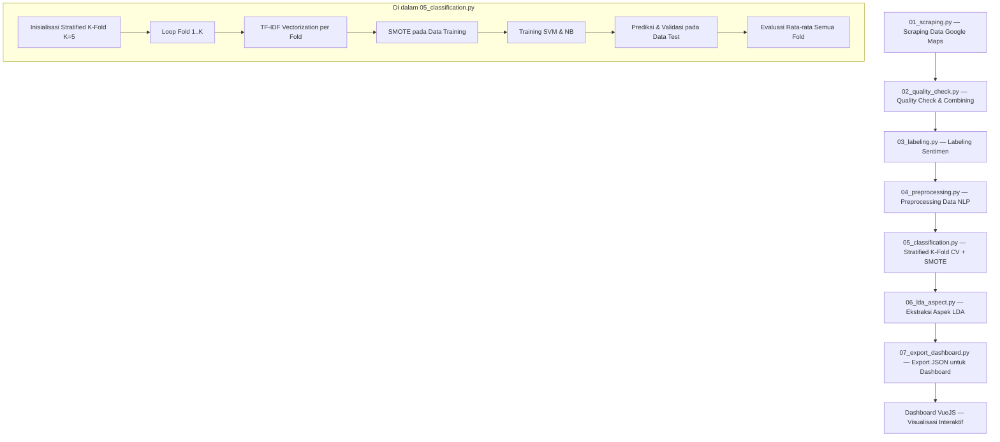

# Implementation Plan: Aspect-Based Sentiment Analysis — Mie Gacoan Surabaya

## Deskripsi Project

Project ini bertujuan untuk melakukan **Aspect-Based Sentiment Analysis (ABSA)** terhadap ulasan pelanggan restoran Mie Gacoan di seluruh kota Surabaya (12 cabang). Hasil analisis akan divisualisasikan dalam **dashboard interaktif VueJS** yang dapat digunakan oleh pihak manajemen sebagai tool analisa sentimen pelanggan.

**Sentimen**: Positif & Negatif  
**Algoritma Klasifikasi**: SVM & Naive Bayes (sebagai pembanding)  
**Algoritma Aspek**: LDA (Latent Dirichlet Allocation)  
**Evaluasi**: Accuracy, Precision, Recall, F1-Score (klasifikasi) + DBI (aspek)  
**Metode Validasi**: Stratified K-Fold Cross-Validation (K=5) + SMOTE  

---

## Alur Proses Pipeline (Sesuai Urutan Script)



---

## User Review Required

> [!IMPORTANT]
> **Pelabelan Sentimen Otomatis vs Manual**  
> Dengan target 60.000 ulasan, pelabelan manual tidak realistis. Saya mengusulkan **pelabelan otomatis berbasis rating**:
>
> - ⭐ Rating 1-2 → **Negatif**
> - ⭐ Rating 4-5 → **Positif**
> - ⭐ Rating 3 → **Dibuang** (ambigu/netral)
>
> Apakah pendekatan ini sesuai, atau Anda ingin menyertakan rating 3 ke salah satu kategori?

> [!IMPORTANT]
> **Target 5.000 ulasan per cabang**  
> Google Maps memiliki limitasi teknis — tidak semua cabang memiliki 5.000 ulasan yang tersedia. Scraper akan mengambil **sebanyak mungkin** ulasan yang tersedia per cabang. Jika total tidak mencapai 60.000, data tetap valid untuk analisis selama distribusinya cukup representatif.

> [!WARNING]
> **Waktu Scraping**  
> Scraping 60.000 ulasan dari 12 cabang akan memakan waktu cukup lama (estimasi 6-12 jam total tergantung koneksi internet). Proses ini akan berjalan otomatis satu cabang per satu cabang.

---

## Struktur Project

```
scrapinggacoan2026/
├── data/
│   ├── raw/                          # Data mentah per cabang (CSV)
│   ├── combined/                     # Data gabungan semua cabang
│   ├── labeled/                      # Data yang sudah dilabeli sentimen
│   ├── preprocessed/                 # Data yang sudah di-preprocessing
│   └── export/                       # Data JSON untuk dashboard
├── models/                           # Model SVM, NB, LDA, Vectorizer yang disimpan
├── results/                          # Hasil evaluasi & visualisasi
│   ├── classification_report.txt     # Laporan K-Fold CV lengkap
│   ├── kfold_results.json            # Metrik K-Fold dalam format JSON
│   ├── kfold_metrics_comparison.png  # Grafik perbandingan metrik per fold
│   ├── cm_svm.png                    # Confusion Matrix SVM (akumulasi fold)
│   ├── cm_nb.png                     # Confusion Matrix NB (akumulasi fold)
│   ├── lda_results.json              # Hasil LDA dalam format JSON
│   ├── lda_dbi_evaluation.png        # Grafik DBI evaluation
│   ├── lda_topics_report.txt         # Keyword per topik
│   └── aspect_sentiment_analysis.txt # Analisis aspek per sentimen
├── scripts/
│   ├── 01_scraping.py                # Tahap 1: Scraping ulasan Google Maps
│   ├── 02_quality_check.py           # Tahap 2: Quality Check & Combining
│   ├── 03_labeling.py                # Tahap 3: Pelabelan sentimen otomatis
│   ├── 04_preprocessing.py           # Tahap 4: Preprocessing NLP
│   ├── 05_classification.py          # Tahap 5: Stratified K-Fold CV + SMOTE + SVM & NB
│   ├── 06_lda_aspect.py              # Tahap 6: Ekstraksi aspek dengan LDA
│   └── 07_export_dashboard.py        # Tahap 7: Export data JSON untuk dashboard
├── dashboard/                        # VueJS Dashboard
│   ├── src/
│   │   ├── components/
│   │   ├── views/
│   │   ├── assets/
│   │   ├── router/
│   │   ├── App.vue
│   │   └── main.js
│   ├── public/
│   └── package.json
├── requirements.txt                  # Python dependencies
└── README.md
```

---

## Proposed Changes

### Tahap 1: Setup Environment & Scraping Data

#### [EXISTING] requirements.txt

Dependencies Python yang dibutuhkan:

- `selenium` — Web scraping automation
- `webdriver-manager` — Auto-manage ChromeDriver
- `pandas` — Data manipulation
- `numpy` — Numerical computing
- `scikit-learn` — SVM, Naive Bayes, evaluasi metrics, DBI
- `imbalanced-learn` — SMOTE (Synthetic Minority Over-sampling Technique)
- `nltk` — NLP toolkit
- `Sastrawi` — Stemming Bahasa Indonesia
- `gensim` — LDA topic modeling
- `matplotlib` & `seaborn` — Visualisasi

#### [EXISTING] scripts/01_scraping.py

Script scraping yang diperbaiki dan ditingkatkan:

- Fix semua bug dari script asli
- **Daftar 12 cabang** dengan link Google Maps
- Menggunakan `webdriver-manager` agar ChromeDriver otomatis terunduh
- Scroll otomatis untuk memuat semua ulasan
- Klik "Selengkapnya" / "Lainnya" untuk mendapatkan teks review lengkap
- Ekstraksi: `nama_cabang`, `nama_pelanggan`, `tanggal_ulasan`, `rating`, `teks_komentar`
- Output: CSV per cabang di `data/raw/`
- Resume capability (jika scraping terhenti, bisa dilanjutkan)
- Progress logging

---

### Tahap 2: Quality Check & Combining Data

#### [EXISTING] scripts/02_quality_check.py

- Scan semua CSV di `data/raw/`
- Validasi struktur (kolom lengkap, tidak ada null di teks_komentar)
- Tampilkan statistik per cabang (jumlah data, distribusi rating)
- Deteksi dan hapus duplikat
- Gabungkan menjadi satu file `data/combined/all_reviews.csv`

---

### Tahap 3: Pelabelan Data

#### [EXISTING] scripts/03_labeling.py

- Membaca data dari `data/combined/all_reviews.csv`
- Labeling otomatis berdasarkan rating:
  - Rating 1-2 → `negatif`
  - Rating 4-5 → `positif`
  - Rating 3 → dibuang (ambigu)
- Output: `data/labeled/labeled_reviews.csv`
- Statistik distribusi label

---

### Tahap 4: Preprocessing Data

#### [EXISTING] scripts/04_preprocessing.py

Pipeline preprocessing Bahasa Indonesia:

1. **Cleaning Data** — Hapus URL, emoji, mentions, angka, karakter spesial
2. **Case Folding** — Semua teks menjadi lowercase
3. **Normalization** — Normalisasi slang/singkatan Bahasa Indonesia
4. **Tokenizing** — Pecah teks menjadi token/kata
5. **Stopword Removal** — Hapus stopword Bahasa Indonesia menggunakan NLTK + custom stopwords
6. **Stemming** — Stemming Bahasa Indonesia menggunakan Sastrawi

- Output: `data/preprocessed/preprocessed_reviews.csv`
- Kolom tambahan untuk setiap tahap preprocessing (agar bisa di-track)

---

### Tahap 5: Klasifikasi Sentimen — Stratified K-Fold Cross-Validation

#### [UPDATED] scripts/05_classification.py

> **Perubahan besar dari versi sebelumnya:** Sekarang menggunakan Stratified K-Fold Cross-Validation (K=5) + SMOTE, menggantikan simple train/test split.

Alur di dalam script:

1. **Inisialisasi Stratified K-Fold** (K=5, shuffle=True)
2. **Loop K-Fold** (untuk setiap fold):
   - **a) TF-IDF Vectorization** — fit pada data train, transform pada data test (**di dalam fold** agar kosakata data uji tidak bocor ke data latih)
   - **b) SMOTE** — hanya diterapkan pada data **Training** (data test tetap murni)
   - **c) Training Model** — SVM (linear kernel) & Naive Bayes (MultinomialNB)
   - **d) Prediksi & Validasi** — pada data test murni tanpa SMOTE
3. **Evaluasi Akhir** — rata-rata Accuracy, Precision, Recall, F1-Score ± std dari semua fold
4. **Simpan model terbaik** (fold dengan F1-Score tertinggi)

Output:
- `models/svm_model.pkl` — Model SVM terbaik
- `models/nb_model.pkl` — Model NB terbaik
- `models/tfidf_vectorizer.pkl` — TF-IDF vectorizer dari fold terbaik
- `results/classification_report.txt` — Laporan evaluasi lengkap
- `results/kfold_results.json` — Metrik K-Fold dalam format JSON (untuk dashboard)
- `results/kfold_metrics_comparison.png` — Grafik perbandingan metrik per fold
- `results/cm_svm.png` — Confusion Matrix SVM (akumulasi semua fold)
- `results/cm_nb.png` — Confusion Matrix NB (akumulasi semua fold)

---

### Tahap 6: Ekstraksi Aspek dengan LDA

#### [UPDATED] scripts/06_lda_aspect.py

- CountVectorizer + LDA topic modeling
- Eksperimen jumlah topik optimal (3, 4, 5, 6, 7)
- Evaluasi menggunakan **Davies-Bouldin Index (DBI)**
- Identifikasi aspek dominan dan keyword per topik
- **Analisis aspek per sentimen** — membedah topik/aspek apa yang sering muncul pada sentimen positif atau negatif
- Export `lda_results.json` untuk dashboard

Output:
- `data/preprocessed/reviews_with_aspects.csv` — Dataset master dengan sentimen + aspek
- `models/lda_count_vectorizer.pkl` — CountVectorizer
- `models/lda_model.pkl` — Model LDA terbaik
- `results/lda_dbi_evaluation.png` — Grafik DBI
- `results/lda_topics_report.txt` — Keyword per topik
- `results/lda_results.json` — Hasil LDA dalam JSON
- `results/aspect_sentiment_analysis.txt` — Analisis aspek per sentimen

---

### Tahap 7: Export Data untuk Dashboard

#### [UPDATED] scripts/07_export_dashboard.py

- Export semua hasil analisis ke format JSON untuk dikonsumsi dashboard VueJS
- Data meliputi:
  - Statistik sentimen per cabang
  - Distribusi aspek per cabang
  - **Cross-tabulation Aspek x Sentimen**
  - **Hasil K-Fold CV** (dimuat dari `kfold_results.json`)
  - **Hasil LDA** (dimuat dari `lda_results.json`)
  - Sampel ulasan untuk Data Explorer (1500 record)

Output: `data/export/dashboard_data.json`

---

### Tahap 8: Dashboard Interaktif VueJS (Frontend)

#### [EXISTING] `dashboard/` — Aplikasi VueJS

Fitur-fitur dashboard untuk manajemen restoran:

1. **Dashboard Overview**
   - Total ulasan yang dianalisis
   - Distribusi sentimen keseluruhan (pie/donut chart)
   - Perbandingan sentimen antar cabang (bar chart)
   - Trend sentimen berdasarkan waktu (line chart)

2. **Analisis Per Cabang**
   - Pilih cabang tertentu
   - Distribusi sentimen cabang tersebut
   - Aspek dominan per cabang
   - Ulasan terbaru dengan sentimen & aspek

3. **Perbandingan Algoritma (K-Fold CV)**
   - Tabel perbandingan SVM vs Naive Bayes
   - Metrics per fold: Accuracy, Precision, Recall, F1-Score
   - Rata-rata +/- Standar Deviasi
   - Confusion Matrix visual
   - Grafik perbandingan metrik per fold

4. **Analisis Aspek (LDA)**
   - Daftar aspek yang ditemukan
   - Word cloud per aspek
   - Distribusi sentimen per aspek
   - DBI score dan evaluasi
   - Aspek mana yang perlu perbaikan

5. **Tool Analisis Sentimen Real-time**
   - Input teks ulasan manual
   - Prediksi sentimen menggunakan SVM & Naive Bayes
   - Tampilkan hasil kedua algoritma sebagai pembanding

6. **Data Explorer**
   - Tabel interaktif semua ulasan
   - Filter berdasarkan cabang, sentimen, aspek
   - Search functionality
   - Export data

---

## Verification Plan

### Automated Tests

1. **Scraping**: Cek jumlah data yang berhasil di-scrape per cabang, validasi format CSV
2. **Quality Check**: Validasi struktur data gabungan
3. **Preprocessing**: Cek integritas data sebelum dan sesudah preprocessing
4. **Klasifikasi (K-Fold)**: Evaluasi rata-rata metrics dari K fold (Accuracy, Precision, Recall, F1-Score +/- std)
5. **LDA**: DBI score untuk mengevaluasi kualitas clustering aspek
6. **Dashboard**: Test semua fitur di browser, memastikan data tampil dengan benar

### Manual Verification

- User memverifikasi sample hasil scraping apakah sesuai dengan ulasan di Google Maps
- User memverifikasi kualitas hasil preprocessing
- User memvalidasi aspek yang ditemukan LDA apakah masuk akal secara bisnis
- User menguji dashboard di browser untuk keperluan presentasi/skripsi

---

## Urutan Pengerjaan

| No  | Tahap                                         | Script                    | Status           |
| --- | --------------------------------------------- | ------------------------- | ---------------- |
| 1   | Setup environment + Install dependencies      | `requirements.txt`        | ✅ Selesai       |
| 2   | Scraping data 12 cabang                       | `01_scraping.py`          | ✅ Selesai       |
| 3   | Quality Check & Combining                     | `02_quality_check.py`     | ✅ Selesai       |
| 4   | Pelabelan sentimen                            | `03_labeling.py`          | ✅ Selesai       |
| 5   | Preprocessing data NLP                        | `04_preprocessing.py`     | ✅ Selesai       |
| 6   | Klasifikasi: Stratified K-Fold CV + SMOTE     | `05_classification.py`    | 🔄 Perlu Re-run |
| 7   | Ekstraksi aspek LDA                           | `06_lda_aspect.py`        | 🔄 Perlu Re-run |
| 8   | Export data untuk dashboard                   | `07_export_dashboard.py`  | 🔄 Perlu Re-run |
| 9   | Dashboard VueJS (Frontend)                    | `dashboard/`              | 🔄 30% Selesai  |

> **Tahap 1-5 telah selesai.** Tahap 6-8 memerlukan re-run karena `05_classification.py` telah di-update total untuk mengimplementasi Stratified K-Fold Cross-Validation + SMOTE.
> Tahap 9 (Dashboard VueJS) sedang dalam pengerjaan.

> **Cara menjalankan ulang pipeline (dari quality check sampai export):**
> ```bash
> cd scrapinggacoan2026
> python scripts/02_quality_check.py
> python scripts/03_labeling.py
> python scripts/04_preprocessing.py
> pip install imbalanced-learn
> python scripts/05_classification.py
> python scripts/06_lda_aspect.py
> python scripts/07_export_dashboard.py
> ```
