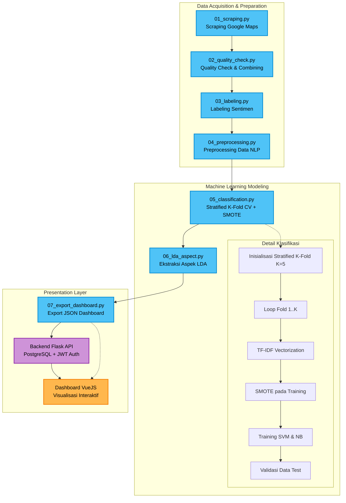
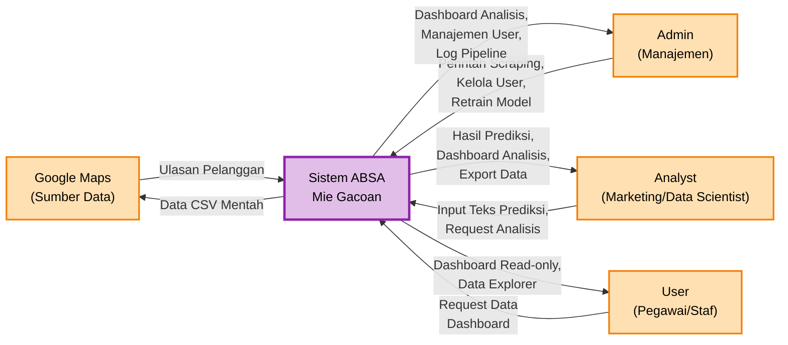
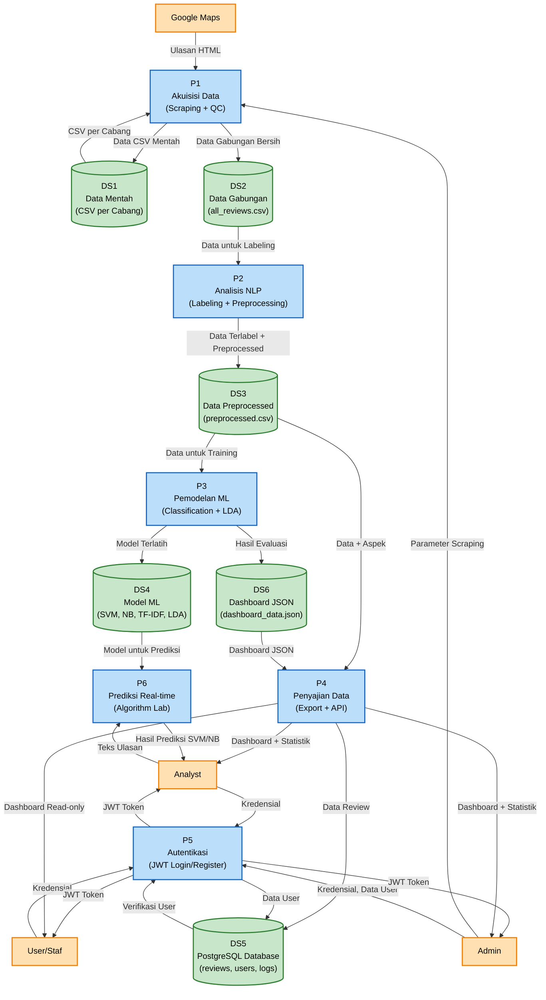
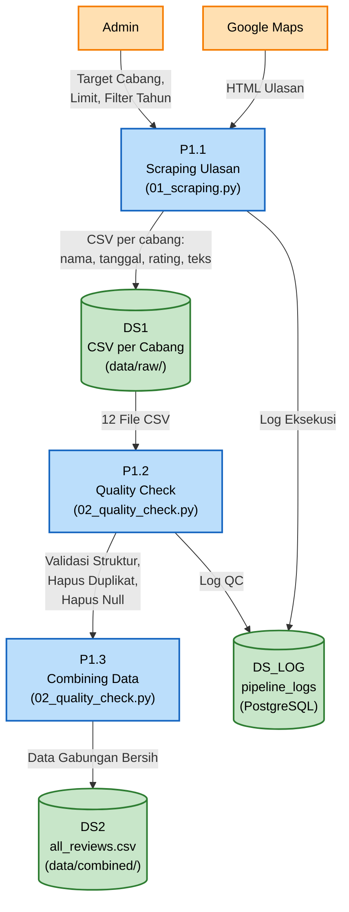
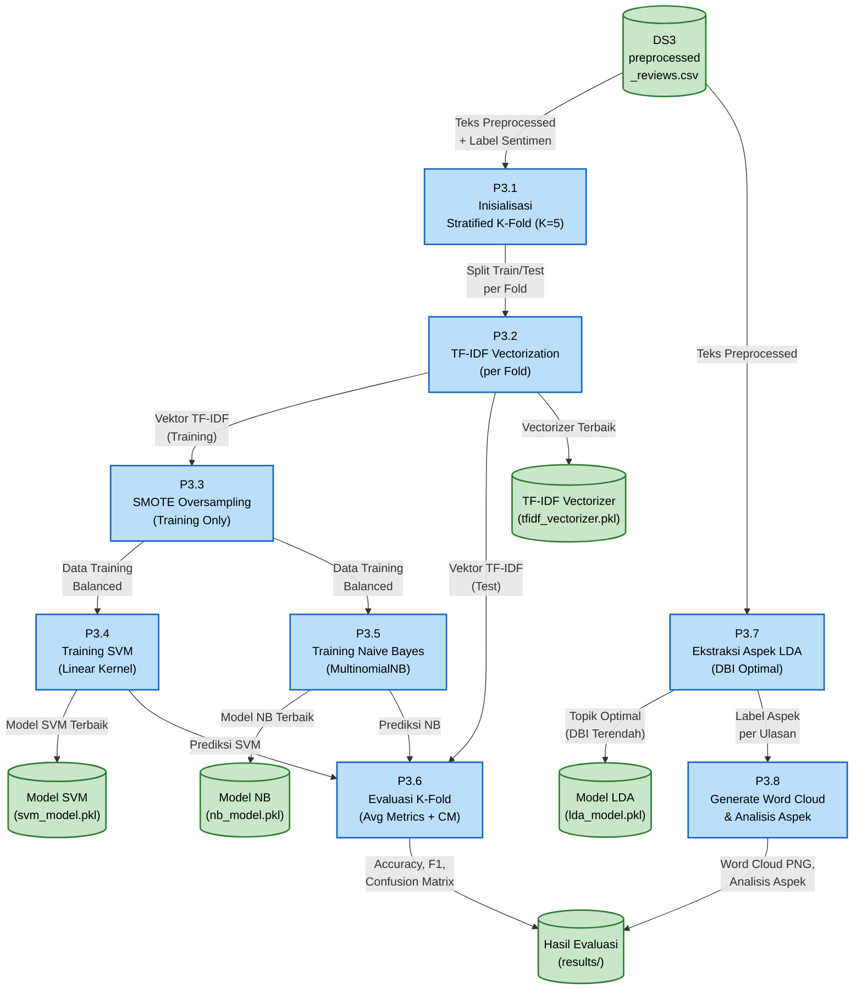
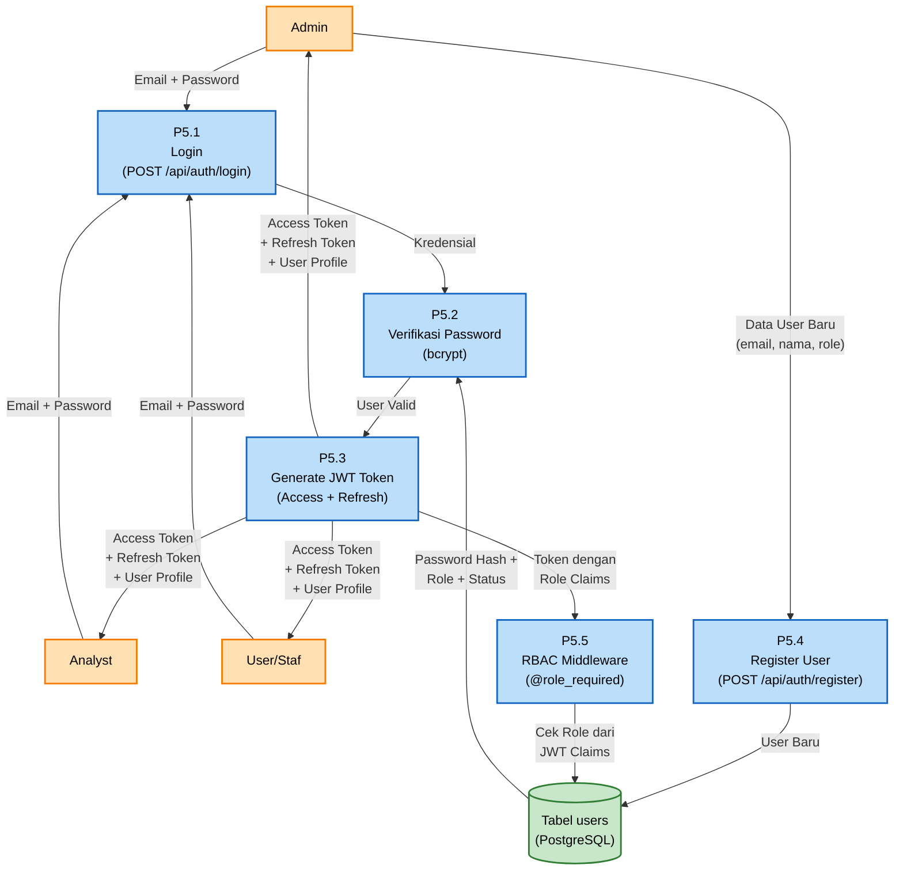

# Alur Proses Pipeline ABSA Mie Gacoan

Berikut adalah representasi visual dari alur data pada proyek Aspect-Based Sentiment Analysis Mie Gacoan Surabaya.

## Deskripsi Flow

1. **Scraping**: Pengumpulan data mentah dari ulasan Google Maps.
2. **Quality Check**: Pembersihan duplikat, pengecekan nilai null, dan menggabungkan semua data.
3. **Labeling**: Pelabelan ke kelas Positif, Negatif, Netral berdasarkan kombinasi rating bintang dan sentimen teks komentar (lexicon matching).
4. **Preprocessing**: Pembersihan teks, stemming, tokenizing.
5. **Classification**: Melatih model dengan mengatasi ketidakseimbangan data (SMOTE) dan divalidasi dengan K-Fold untuk hasil objektif.
6. **LDA Aspect**: Mengekstrak topik utama secara dinamis berdasarkan skor evaluasi DBI terendah (Range K=3-10) beserta pembuatan Word Cloud untuk visualisasi.
7. **Export**: Mempersiapkan dataset JSON akhir.
8. **Backend API**: REST API fullstack (Flask + PostgreSQL + JWT) untuk autentikasi, data serving, dan prediksi real-time.
9. **Dashboard**: Menampilkan metrik (Positif, Negatif, Netral), analisis cabang dengan sampel seimbang, performa algoritma, evaluasi DBI, dan tool sentimen secara interaktif dengan dukungan *Dark Mode*.

---

## Data Flow Diagram (DFD)

### DFD Level 0 — Context Diagram

Menunjukkan sistem ABSA Mie Gacoan sebagai satu proses tunggal beserta entitas eksternalnya.

### DFD Level 1 — Dekomposisi Proses Utama

Menunjukkan 6 proses utama di dalam sistem beserta data store-nya.

### DFD Level 2 — Detail Proses Kritis

#### DFD Level 2.1 — Dekomposisi P1: Akuisisi Data

#### DFD Level 2.3 — Dekomposisi P3: Pemodelan ML

#### DFD Level 2.5 — Dekomposisi P5: Autentikasi & RBAC

---

## Legenda DFD

| Simbol | Arti |
|--------|------|
| Persegi panjang (rounded) | **Entitas Eksternal** — aktor di luar sistem |
| Persegi panjang (blue) | **Proses** — transformasi data |
| Silinder (green) | **Data Store** — penyimpanan data |
| Panah | **Aliran Data** — arah pergerakan data |

### Mapping Role → Hak Akses per Proses

| Proses | Admin | Analyst | User |
|--------|-------|---------|------|
| P1 — Akuisisi Data (Scraping) | ✅ Mulai/Stop | ❌ | ❌ |
| P2 — Analisis NLP | ✅ Trigger | ❌ | ❌ |
| P3 — Pemodelan ML (Retrain) | ✅ Trigger | ✅ Trigger | ❌ |
| P4 — Penyajian Data (Dashboard) | ✅ Full | ✅ Full | ✅ Read-only |
| P5 — Autentikasi (Register User) | ✅ CRUD User | ❌ | ❌ |
| P6 — Prediksi Real-time | ✅ Prediksi | ✅ Prediksi | ❌ |
