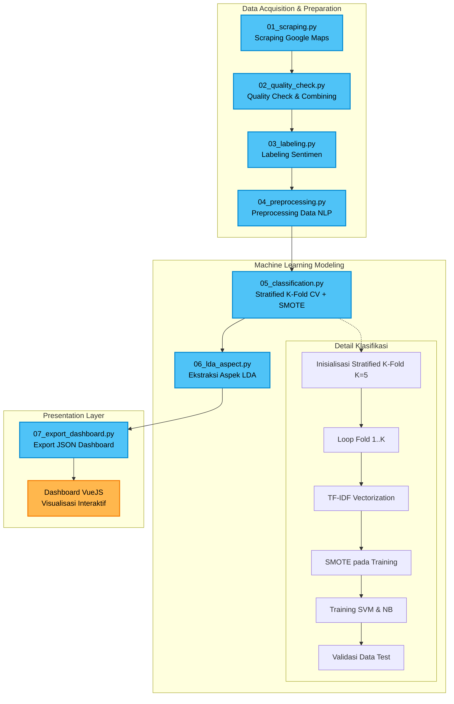

# Alur Proses Pipeline ABSA Mie Gacoan

Berikut adalah representasi visual dari alur data pada proyek Aspect-Based Sentiment Analysis Mie Gacoan Surabaya.

## Deskripsi Flow
1. **Scraping**: Pengumpulan data mentah dari ulasan Google Maps.
2. **Quality Check**: Pembersihan duplikat, pengecekan nilai null, dan menggabungkan semua data.
3. **Labeling**: Pelabelan ke kelas Positif, Negatif, Netral berdasarkan rating bintang.
4. **Preprocessing**: Pembersihan teks, stemming, tokenizing.
5. **Classification**: Melatih model dengan mengatasi ketidakseimbangan data (SMOTE) dan divalidasi dengan K-Fold untuk hasil objektif.
6. **LDA Aspect**: Mengekstrak topik yang sering dibicarakan (Rasa, Harga, dll).
7. **Export**: Mempersiapkan dataset JSON akhir.
8. **Dashboard**: Menampilkan metrik, analisis cabang, performa algoritma, dan tool sentimen.
